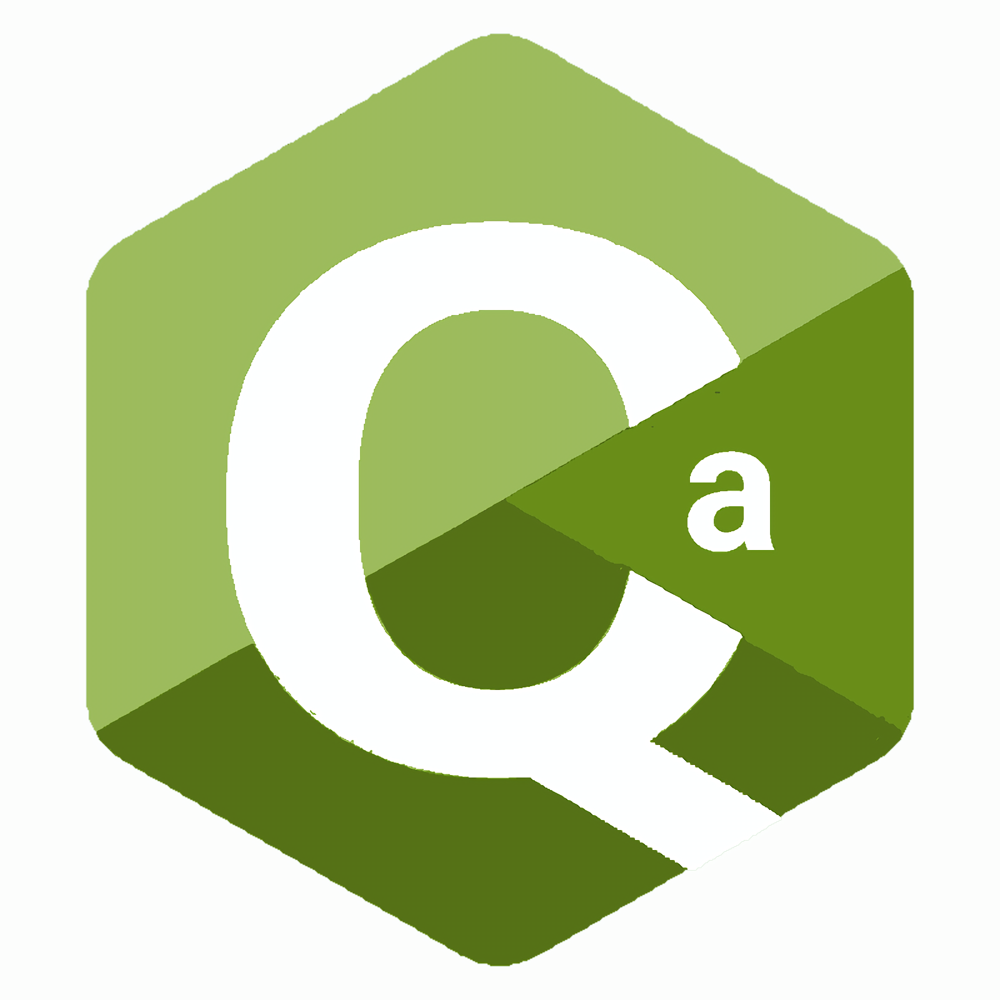

  <table border="0">
    <tr>
      <td>
        
      </td>
      <td>
        <h1>Qa programming language</h1>
      </td>
    </tr>
  </table>
  <h3>Currently Qa is in active developement</h3>

# A minimalist, high-performance programming language.
Qa provides a clean, quick execution environment with an easy, streamlined syntax.

Whether you're writing simple scripts or modular tools, Qa makes the process feel native and light.

Qack - a fast, modern and feature-full compiler powered by Rust handles the complexity for you, turning your sources into optimized binaries.

## Key Features
 - Zero-Overhead Functions: No header files or prototypes. *Just have FUN*, and run with EXEC!
 - Recursive Imports: Build complex projects by importing other .qa files - qack handles the dependency tree for you.
 - Cross-Compatibility: Write code once for all platforms - qack automatically maps system calls like sleep or clear for all common OSes.

[See some examples](examples)
